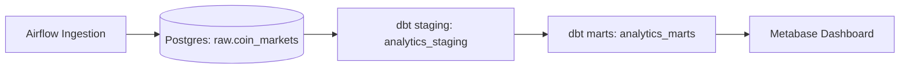
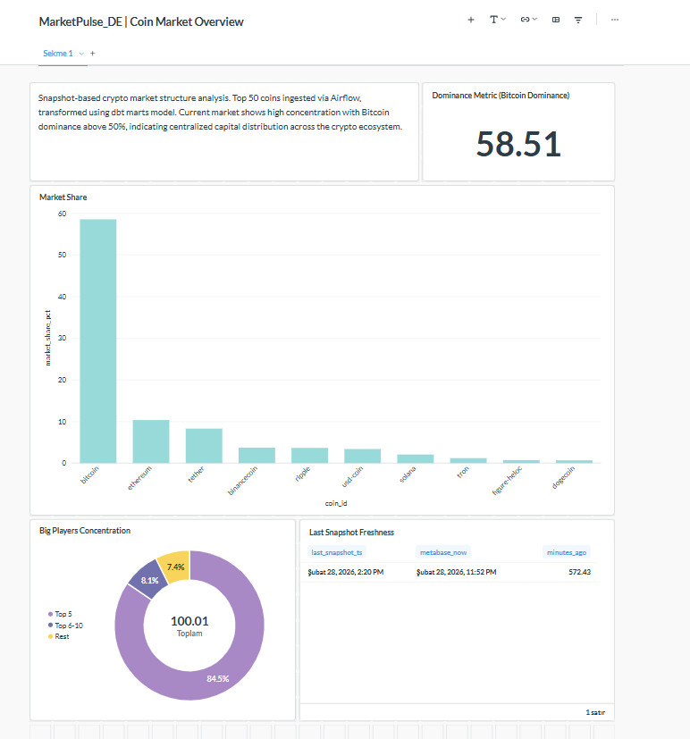
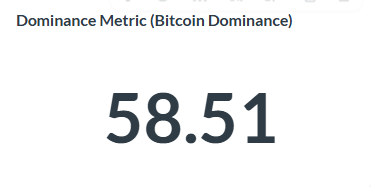
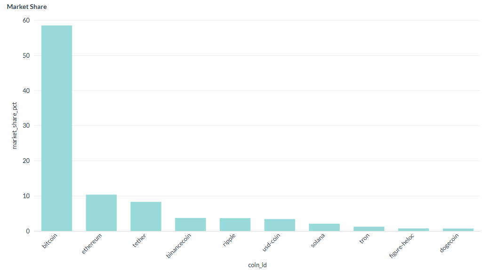
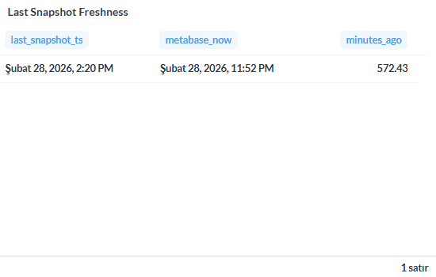
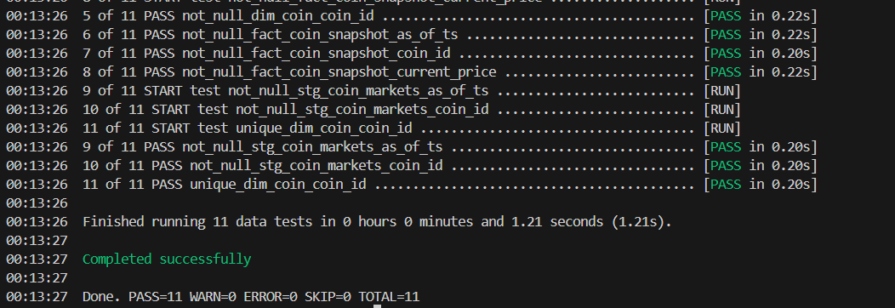
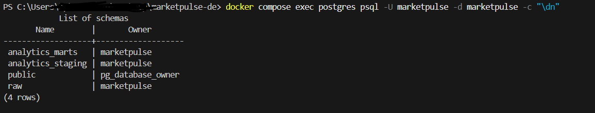
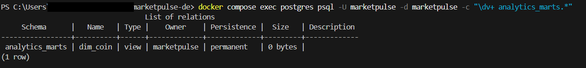
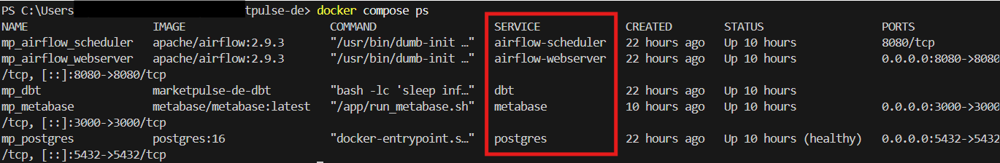

# MarketPulse-DE

End-to-end Data Engineering demo built with Docker Compose.

Docker Compose ile ayağa kalkan uçtan uca bir Veri Mühendisliği demo
projesi.

Airflow ham veriyi Postgres (raw) katmanına yükler, dbt dönüşümleri
gerçekleştirir (staging/marts), Metabase ise analitik dashboard sunar.

------------------------------------------------------------------------

## 🧱 Architecture / Mimari

------------------------------------------------------------------------

## 📊 Dashboard Overview

### BTC Dominance

### Market Share

### Snapshot Freshness

------------------------------------------------------------------------

## 🔎 Technical Validation

### dbt Run & Test (PASS)

### Clean Schema Validation

### Marts Layer Verification

### Docker Services Running

------------------------------------------------------------------------

## 🚀 Local Setup Guide

### 1) Clone

git clone https://github.com/OzgurKaptann/marketpulse-de.git cd
marketpulse-de

### 2) Start Infrastructure

docker compose up -d --build docker compose ps

### 3) Run dbt

docker compose exec dbt bash -lc "dbt run --target dev && dbt test
--target dev"

------------------------------------------------------------------------

## 🧩 Lessons Learned / Öğrenilenler

### 1) dbt Schema Şişmesi Problemi

Sorun: analytics_analytics_staging gibi gereksiz schema'lar oluştu.

Sebep: dbt default schema naming davranışı.

Çözüm: Custom macro override ile schema kontrol altına alındı.

Son standart: - analytics_staging - analytics_marts

------------------------------------------------------------------------

### 2) Incremental Fact Model

fact_coin_snapshot incremental olarak yapılandırıldı.

Amaç: Snapshot geçmişini zaman içinde büyütmek ve full refresh yükünü
azaltmak.

------------------------------------------------------------------------

## 📁 Project Structure

airflow/ dags/ dbt/ docs/screenshots/ docker-compose.yml

------------------------------------------------------------------------

## License

MIT
