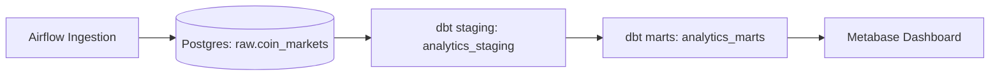

# MarketPulse-DE

End-to-end Data Engineering demo built with Docker Compose.

Docker Compose ile ayağa kalkan uçtan uca bir Veri Mühendisliği demo
projesi.

Airflow ingests crypto market snapshots into Postgres (raw), dbt
transforms them into staging/marts models, and Metabase serves
analytical dashboards.

Airflow ham veriyi Postgres (raw) katmanına yükler, dbt dönüşümleri
gerçekleştirir (staging/marts), Metabase ise analitik dashboard sunar.

------------------------------------------------------------------------

## 🧱 Architecture / Mimari



Stack / Teknoloji Yığını: - Postgres 16 - Airflow 2.9 - dbt 1.9 -
Metabase - Docker Compose

------------------------------------------------------------------------

## 📊 Dashboard Features / Dashboard Özellikleri

-   BTC Dominance (%)
-   Top 10 Market Share (latest snapshot)
-   Market Concentration (Top 5 / Top 6-10 / Rest)
-   Snapshot Freshness (minutes since last snapshot)
-   Price Trend (filterable by coin)

Türkçe Açıklama: - BTC hakimiyet oranı - En büyük 10 coin piyasa payı -
Piyasa yoğunlaşma analizi (Top 5 / Top 6-10 / Diğerleri) - Veri
güncellik metriği (son snapshot kaç dakika önce) - Coin bazlı fiyat
trend grafiği

------------------------------------------------------------------------

## 🗂️ Project Structure / Proje Yapısı

airflow/ dags/ dbt/ ingestion/ warehouse/ docker-compose.yml
.env.example docs/screenshots/

------------------------------------------------------------------------

## 🚀 Local Setup Guide / Lokal Kurulum

### 1) Clone Repository

git clone https://github.com/OzgurKaptann/marketpulse-de.git cd
marketpulse-de

### 2) Configure Environment

cp .env.example .env

Gerekirse `.env` dosyasını düzenleyin.

### 3) Start Infrastructure

docker compose up -d --build docker compose ps

### 4) Run Ingestion (Airflow)

-   Airflow UI: http://localhost:8080
-   Ingestion DAG'i manuel olarak tetikleyin.

Raw tablo kontrolü:

docker compose exec postgres psql -U marketpulse -d marketpulse -c
"select count(\*) from raw.coin_markets;"

### 5) Run dbt Transformations

docker compose exec dbt bash -lc "dbt run --target dev && dbt test
--target dev"

Marts kontrolü:

docker compose exec postgres psql -U marketpulse -d marketpulse -c
"`\dv`{=tex}+ analytics_marts.\*"

### 6) Connect Metabase

Metabase: http://localhost:3000

PostgreSQL bağlantı ayarları: - Host: mp_postgres (ÖNEMLİ: localhost
değil) - Port: 5432 - Database: marketpulse - Username: marketpulse -
Password: .env içindeki değer - Schemas to sync: analytics_marts

------------------------------------------------------------------------

## 🧩 Troubleshooting & Lessons Learned / Karşılaşılan Problemler ve Çözümler

### 1) dbt Schema Şişmesi Problemi

Sorun: analytics_analytics_staging gibi gereksiz schema'lar oluştu.

Sebep: dbt'nin default schema naming davranışı (target.schema + custom
schema birleşimi).

Çözüm: Custom macro override ile schema kontrol altına alındı:

``` sql

    
        {{ target.schema }}
    
        {{ custom_schema_name | trim }}
    

```

Final Standard: - analytics_staging - analytics_marts

------------------------------------------------------------------------

### 2) Metabase Dashboard Kartlarının Bozulması

Sorun: Schema refactor sonrası kartlar hata verdi.

Sebep: Metabase eski schema isimlerine referans veriyordu.

Çözüm: Tüm sorgular yeni schema standardına göre güncellendi.

------------------------------------------------------------------------

### 3) Trend Grafiğinde Tek Nokta Sorunu

Sorun: Line chart yalnızca 1 veri noktası gösterdi.

Sebep: Sadece tek snapshot timestamp vardı.

Çözüm: Ingestion birden fazla kez çalıştırılarak zaman serisi
oluşturuldu.

Kontrol:

select count(distinct as_of_ts) from analytics_marts.fact_coin_snapshot;

------------------------------------------------------------------------

### 4) Incremental Fact Table Yapısı

fact_coin_snapshot incremental olarak yapılandırıldı.

Amaç: Snapshot geçmişini zaman içinde büyütmek ve tam refresh yükünü
azaltmak.

------------------------------------------------------------------------

## 📷 Screenshots

Aşağıdaki dosyalar docs/screenshots klasörüne eklenmelidir:

-   dashboard_overview.png
-   btc_dominance.png
-   market_share.png
-   freshness.png
-   architecture.png

------------------------------------------------------------------------

## License

MIT
